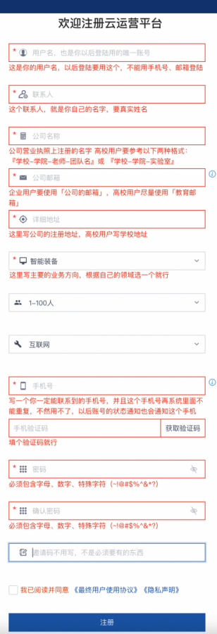
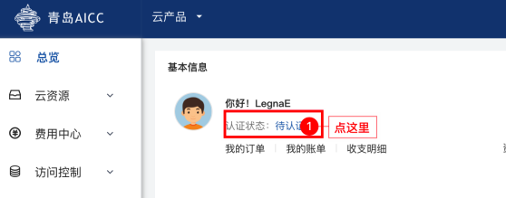
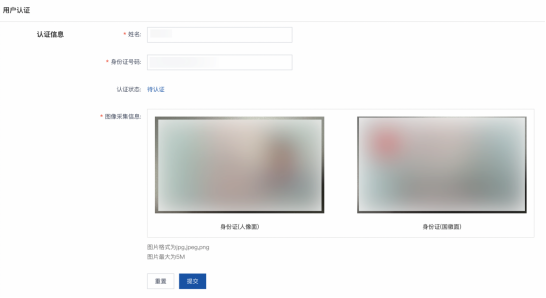
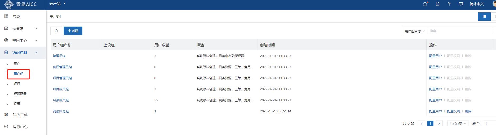
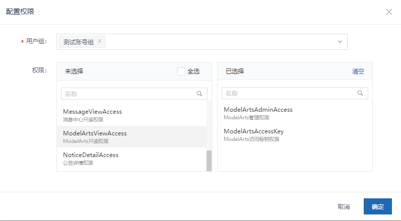
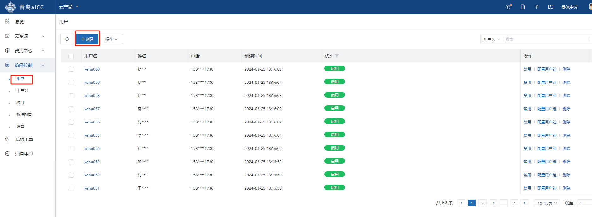
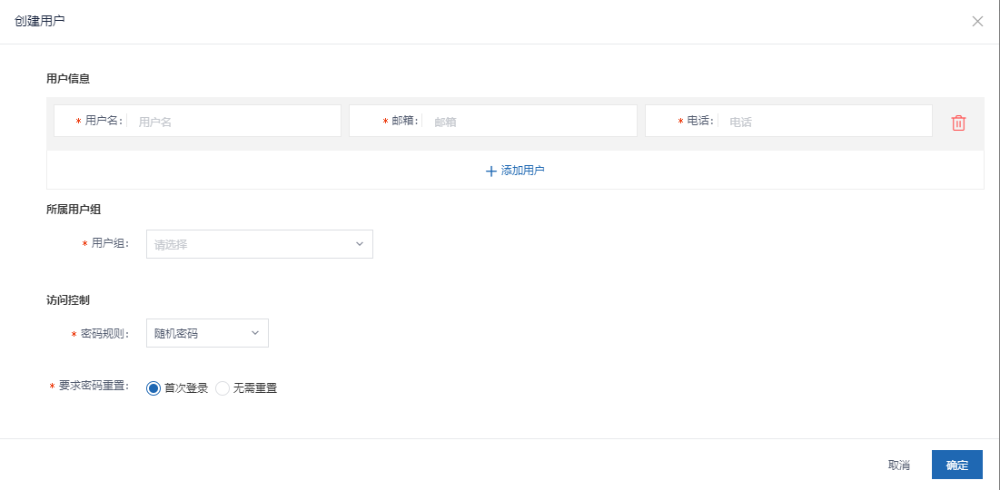

# 账号申请

账号申请请与生态经理联系

## 1.注册云平台账号

警告

针对企业用户：

对于企业用户，一个企业主体的用户，仅可申请、注册、使用一个主账号（公司主体首次申请注册的账号，具有AKSK管理权）

针对高校用户：

对于高校用户，以具体高校教师带领的具体团队为单位，每个老师仅可申请、注册、使用一个主账号（首次申请注册的账号，具有AKSK管理权）

警告

每个主账号可以创建多个子账号供您使用，并且每个主账号与子账号共享350个notebook,请根据业务需求进行资源开通使用，避免浪费

默认注册的账号，在认证后的一个月内无使用 或 注册的账号一周内未经过实名认证，两种情形，均会对账号进行回收

注意

账号注册时使用的邮箱，会作为基本消息通知，如资源池使用、释放、告警等通知内容的通知媒介，请确保邮箱的正常，避免计算资源出现异常后无法第一时间收到通知，影响您业务开展使用。

针对高校用户的注册信息填写规则：

学校-学院-老师-团队名

如：

xx大学xx学院xx老师xx团队

:::

当伙伴需要使用ModelArts资源的时候，需要申请云资源，点击链接访问注册页面
<https://uconsole.qdrgznjszx.com/#/register>

当访问注册界面后，有几个信息需要注意

联系人：需要填写真实姓名

公司名称：需要填写公司全称

公司邮箱：需要使用公司邮箱

邀请码：无需填写

参考如下信息内容进行填写，提交注册后，与生态经理进行联系，开通账号

在申请完成后，请保留以下信息,将信息提供给生态经理，协助您完成账号开通

用户名

公司全名

公司邮箱

手机号

## 2.实名认证

账号开通后，访问云管理平台，使用你已经申请的账号密码进行登入

https://login.qdrgznjszx.com/

界面如下

当你正确登入平台后，检查此处，按提示进行实名认证，认证时间通常为1-3工作日

按照要求填写姓名 身份证号 身份证正面 身份证反面，提交后等待审批

## 3.子账号创建

进入 访问控制 → 用户组，可使用已有的用户组，也可以新建用户组配置规则

### 规则配置

### 新建子账号

进入 访问控制 → 用户 → 创建，新建子账号

子账号在使用前也需要进行实名认证
