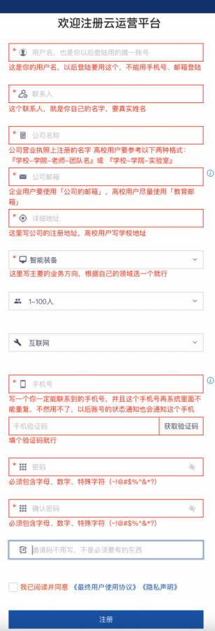

# 账号申请

## 1.注册云平台账号

警告
针对企业用户：
对于企业用户，一个企业主体的用户，仅可申请、注册、使用一个主账号（公司主体首次申请注册的账号，具有AKSK管理权）
针对高校用户：
对于高校用户，以具体高校教师带领的具体团队为单位，每个老师仅可申请、注册、使用一个主账号（首次申请注册的账号，具有AKSK管理权）

警告
每个主账号可以创建多个子账号供您使用，并且每个主账号与子账号共享350个notebook,请根据业务需求进行资源开通使用，避免浪费
默认注册的账号，在认证后的一个月内无使用 或 注册的账号一周内未经过实名认证，两种情形，均会对账号进行回收

针对高校用户的注册信息填写规则：
学校-学院-老师-团队名

如：
xx大学xx学院xx老师xx团队
:::

当伙伴需要使用ModelArts资源的时候，需要申请云资源，点击链接访问注册页面
<https://uconsole.qdrgznjszx.com/#/register>

当访问注册界面后，有几个信息需要注意

联系人：需要填写真实姓名

公司名称：需要填写公司全称

公司邮箱：需要使用公司邮箱

邀请码：无需填写

参考如下信息内容进行填写，提交注册后，与生态经理·进行联系，开通账号

在申请完成后，请保留以下信息,将信息提供给生态经理，协助您完成账号开通

用户名

公司全名

公司邮箱

手机号