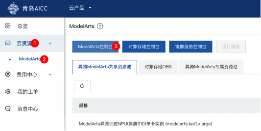
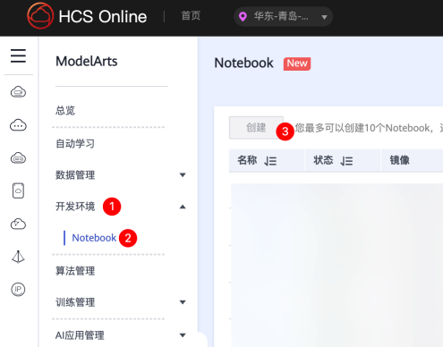
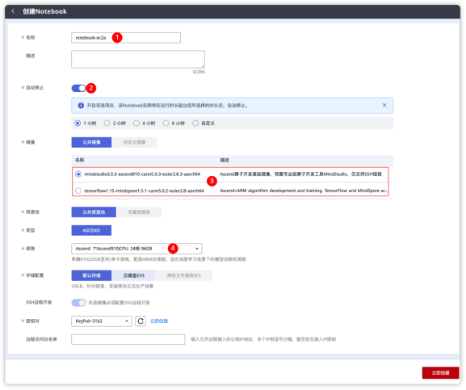
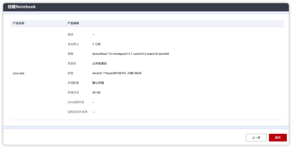
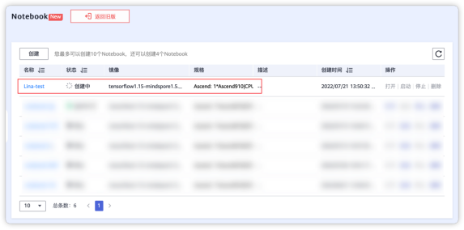
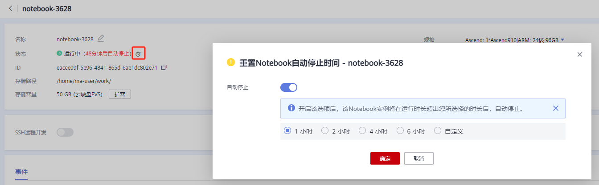
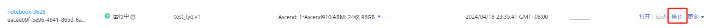
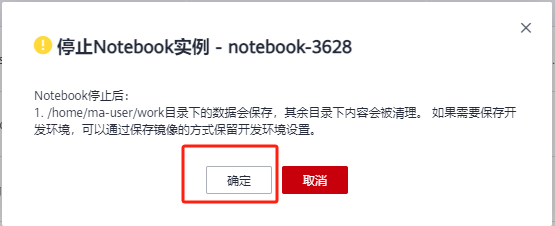

# 资源申请

## 1.资源申请

注意

计资源使用完成后请务必及时释放资源，避免空闲占用，持续计费。

请依次访问 云资源 → ModelArts  → ModelArts控制台 跳转过程会自动鉴权

访问到ModelArts控制台后，请依次访问 开发环境  →  NoteBook  →  创建

点击创建后，会看到如下界面

1.名称：可自由定义

2.自动停止：如果开启此项，Notebook时间到期后资源将无法访问，因此，推荐创建OBS，资源文件从OBS中获取

3.镜像：根据业务开发要求，可根据自己的业务进行选择

4.配置：目前配置有多个可供选择如Ascend910单卡 24核心96GB、Ascend910八卡 192核心720GB

5.密钥对：如果需要SSH（本地VSCode开发）那么就要记录这个密钥对，web访问的话，此部分可以忽略，默认配置即可

如果开启自动停止，Notebook环境会默认在设置的几小时后关闭

如果关闭自动停止，Notebook环境不会自动关闭，必须手动关闭

当你全部准备好的时候，会再次确认你选择的配置，点击提交

创建成功的提醒（非即时创建，可能资源需要等待）

返回列表后，会有如下显示

资源显示创建中，部分资源会比较稀有，使用需要排队，等待创建完成，即可正常使用

## 2.资源关闭

创建Notebook环境时开启自动停止，资源可自动关闭，也可在运行时重置自动停止时间，自动停止时间以最后一次更新为准

Notebook环境关闭自动停止，在不使用时需要手动关闭环境，停止共享资源计费，点击停止后需要确认操作。

注意：

Notebook停止后：

/home/ma-user/work目录下的数据会保存，其余目录下内容会被清理。 如果需要保存开发环境，可以通过保存镜像的方式保留开发环境设置。

