# Notebook训练环境使用

## 开启NoteBook

当资源申请完成后，NoteBook状态变为运行中，点击打开

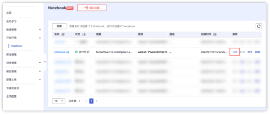

注意
当你使用Chrome/Safari浏览器直接访问的时候，会因SSL问题导致如下提示

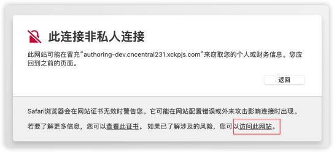

点击访问此网站即可正常使用访问JupyterLab

## 使用JupyterLab

访问到这个页面的时候，就是一个webIDE了，红色标记为创建一个Launcher在Launcher中可以打开新的终端进行使用

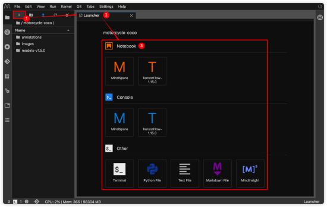

主要功能依次创建Launcher、创建文件夹、上传文件、刷新文件列表、使用GitClone

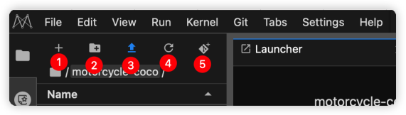

左侧文件列表中，可以自由管理文件，本地文件可以拖拽上传，但文件大小不能超过100MB，如果需要上传数据集或其他代码文件，需要使用OBS进行上传

## Hello ModelArts

我们通过Launcher创建一个Terminal终端，使用如下命令，来进行ModelArts的第一次使用

npu-smi info

反馈如下

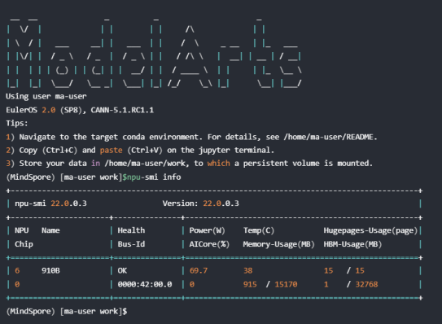

## Notebook ssh访问

在创建Notebook环境时选择SSH远程开发

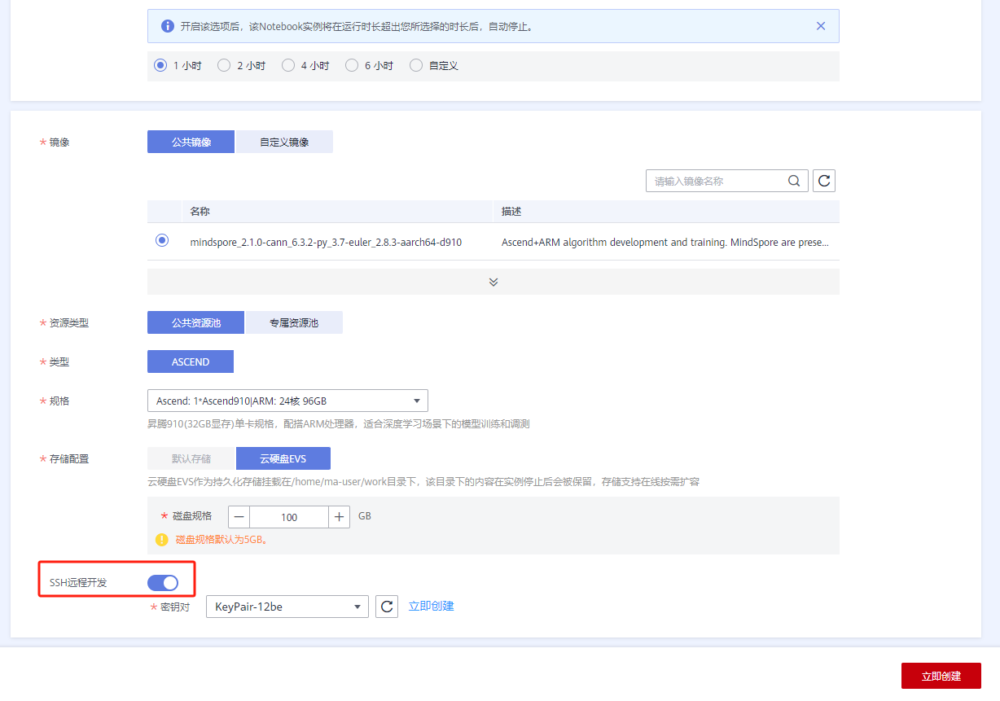

可以选择已有的密钥对，也可以新建密钥。

点击立即创建，可以创建或导入密钥

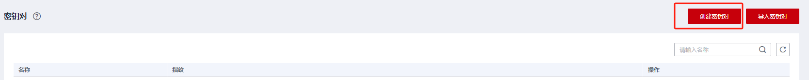

使用ssh地址和密钥就可进行远程访问

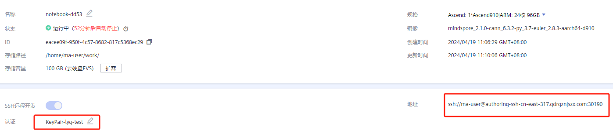

## Notebook VS Code访问

在创建环境时打开ssh访问选项，预先在本地存储密钥，进入后点击“ + ”进入Launcher页面，选择VS Code

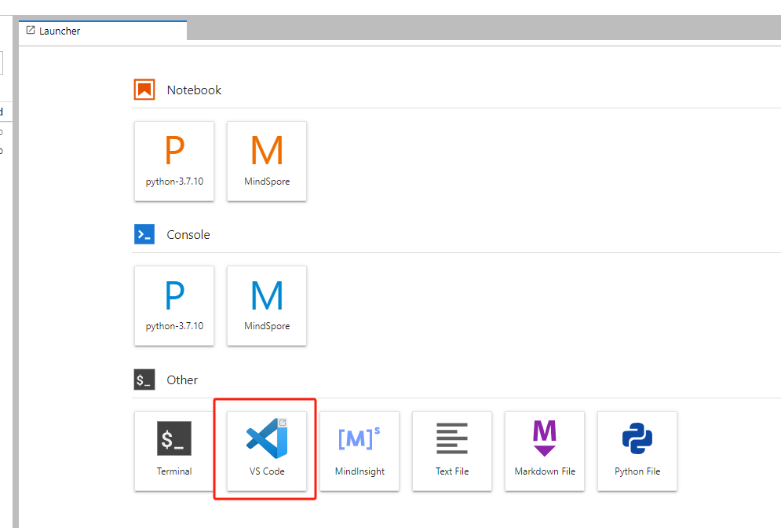

点击跳转到本地VS Code

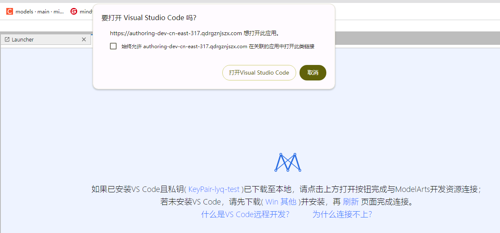

即可在VS Code上使用Notebook环境

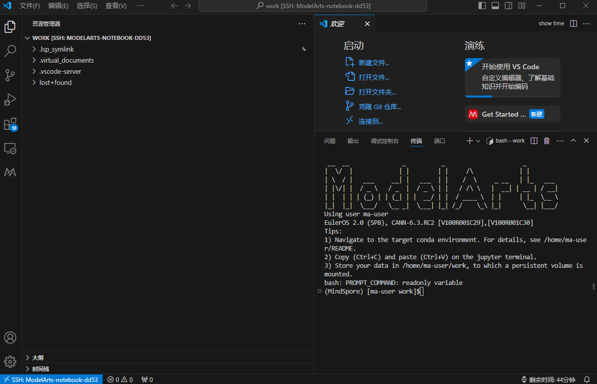