# Notebook镜像上传下载

## 1 获取临时登录指令

进入镜像服务控制台

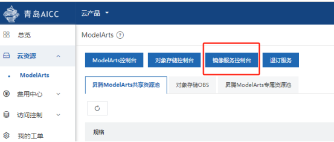

点击组织管理

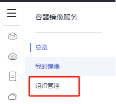

如果没有任何组织，点击右上角创建组织

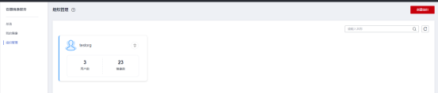

点击我的镜像，选择客户端上传

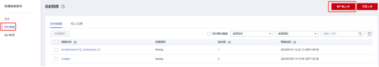

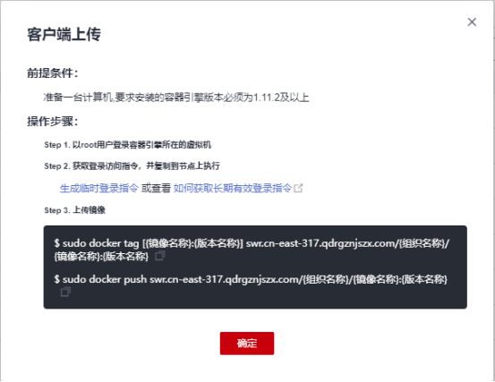

点击生成临时登录指令

## 2 镜像上传

准备一台有root权限的虚拟机或实体机，安装1.11.2版本以上docker

以镜像swr.cn-central-221.ovaijisuan.com/mindformers/mindformers0.8.0_mindspore2.2.0:aicc_20231025为例

需要先下载镜像到本地，下图为下载后查看镜像结果

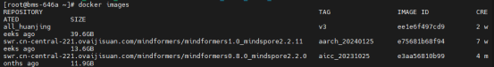

修改镜像的组织名称，示例中的组织名称为testorg，计算中心路径为swr.cn-east-317.qdrgznjszx.com

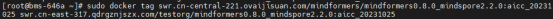

粘贴在网页上复制的登录指令，进行登录

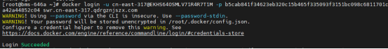

上传镜像

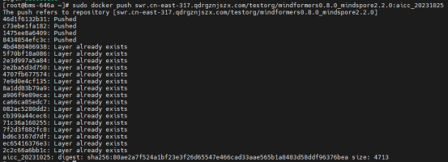

上传的镜像不能直接使用，需要镜像注册

进入ModelAtrs控制台

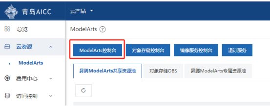

选择镜像管理

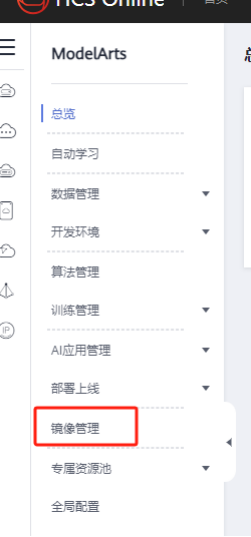

点击注册镜像

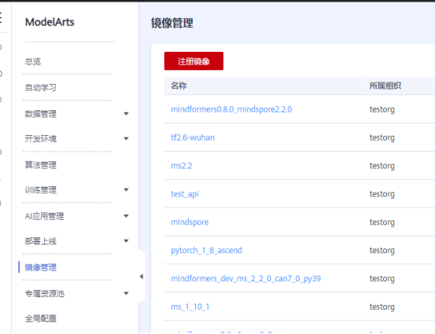

按照要求注册镜像后点击立即注册。

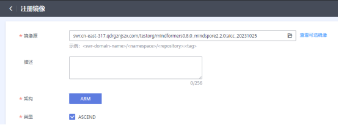

完成后可在notebook新建环境时使用该镜像。

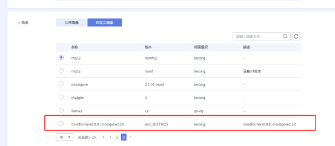

## 3 镜像下载

进入镜像服务控制台→我的镜像，点击镜像名称进入相关界面

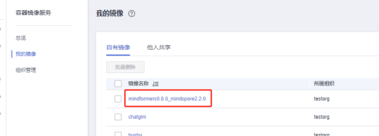

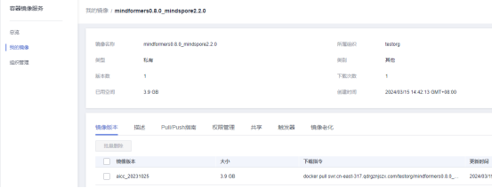

点击Pull/Push指南获取临时登录指令

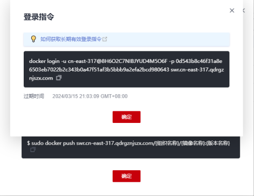

准备一台有root权限的虚拟机或实体机，安装1.11.2版本以上docker

粘贴在网页上复制的登录指令，进行登录

点击镜像版本，复制下载指令

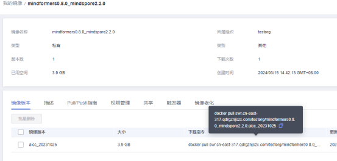

粘贴到刚才登录的有root权限的虚拟机或实体机，下载镜像。

镜像在启动的时候需要依赖tini这个文件。在run命令后面加上--entrypoint=bash。

## 4 notebook当前环境保存为镜像

正在运行的环境，可以保存为镜像。

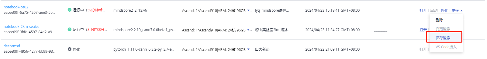

停止运行的环境，可更改使用的镜像。

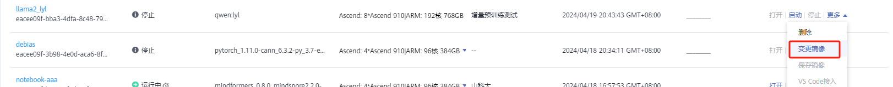
