# OBS云存储使用

## 1 OBS介绍

对象存储服务（Object Storage Service，OBS）是一个基于对象的海量存储服务，为客户提供海量、安全、高可靠、低成本的数据存储能力。

OBS系统和单个桶都没有总数据容量和对象/文件数量的限制，为用户提供了超大存储容量的能力，适合存放任意类型的文件，适合普通用户、网站、企业和开发者使用。OBS是一项面向Internet访问的服务，提供了基于HTTP/HTTPS协议的Web服务接口，用户可以随时随地连接到Internet，通过OBS管理控制台或各种OBS工具访问和管理存储在OBS中的数据。此外，OBS支持SDK和OBS API接口，可使用户方便管理自己存储在OBS上的数据，以及开发多种类型的上层业务应用。

青岛计算中心最大能提供**T存储资源，收费方式为 * /GB/时

使用客户端工具前，请先获取访问密钥(AK和SK) 。

## 2 获取访问密钥

首先用主账号进入青岛AICC的服务控制台，选择云资源菜单下面的modelarts。

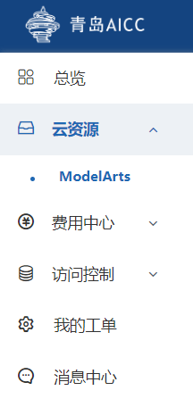

然后点击屏幕左上方访问密钥按钮。

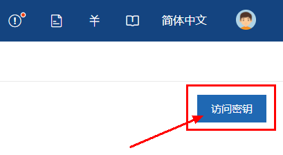

进行创建密钥，创建成功之后的界面如下图。

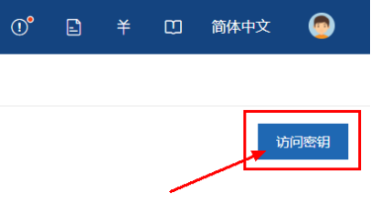

创建成功后密钥会自动下载并保存到本地，务必将密钥保存号，<font color=red>每个密钥只可以下载一次</font>

子账号的密钥与主账号共用，从主账号上获取

## 3 OBS创建桶

进入对象存储控制台，创建桶

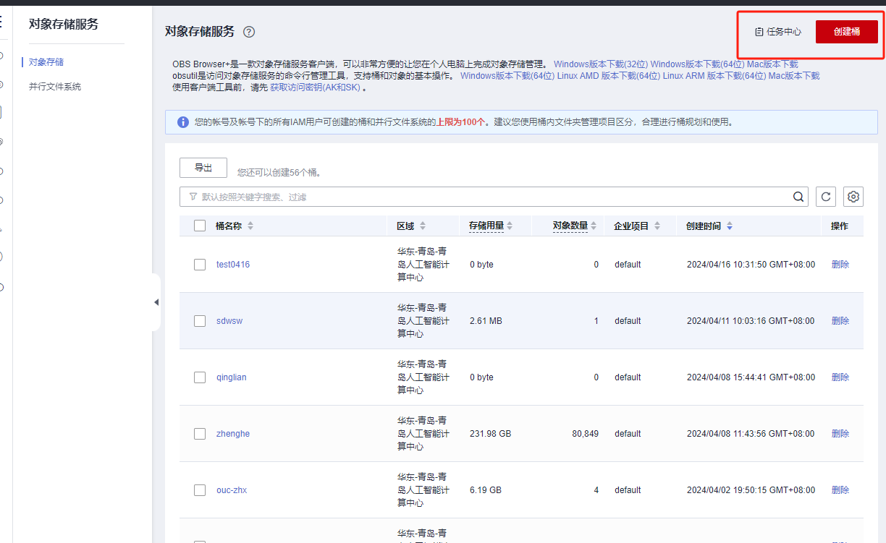

选择桶名称和权限

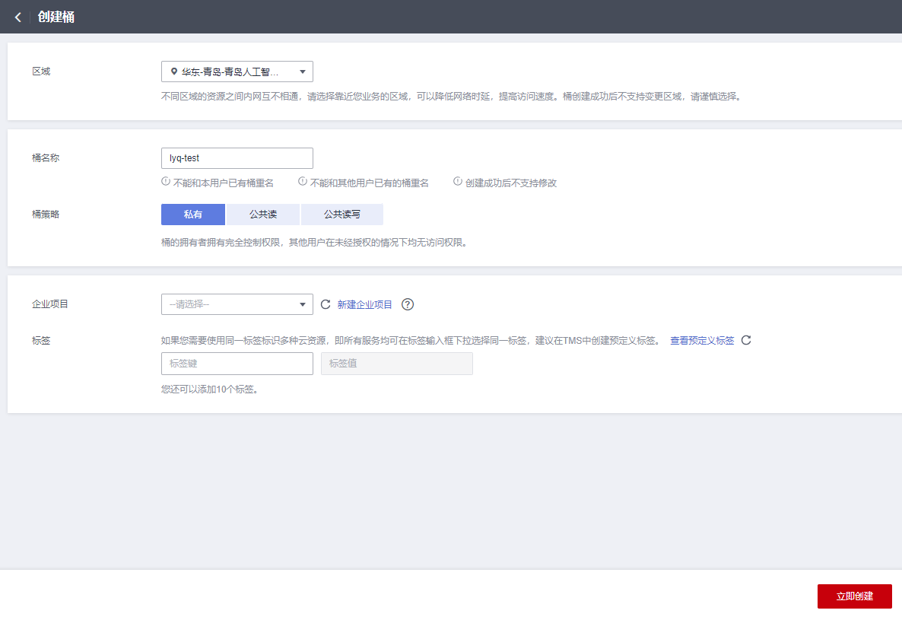

## 4 下载并登录OBS客户端

进入青岛AICC的服务控制台，选择云资源菜单下面的modelarts进入modelarts管理控制页面，选择对象存储控制台。


进入对象存储控制台后下载OBS Browers+对象存储的桌面客户端。

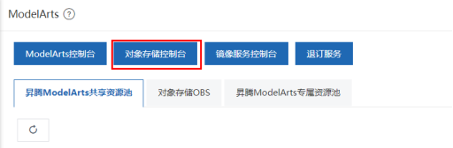

下载完成后打开客户端进行登录。

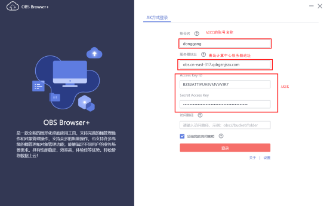

登录成功后会来到下面这个界面

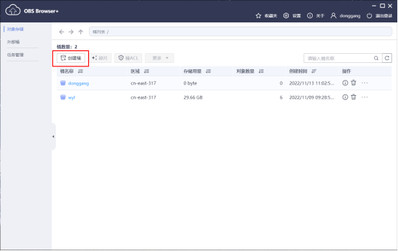

## 5 本地文件OBS上传下载

登录OBS客户端，选择已创建好的桶，上传文件


点击下载按钮可以直接下载文件

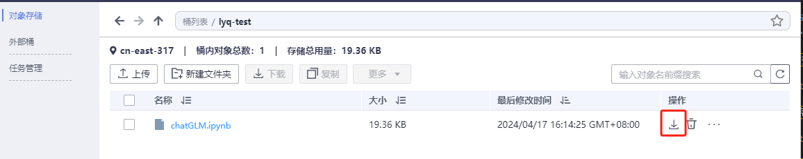

## 6 Notebook文件上传

如果使用网页端进行线上资源使用的话，拖拽上传文件的限制大小是<font color=red>100MB</font>，如果大于100MB就需要用OBS进行上传。

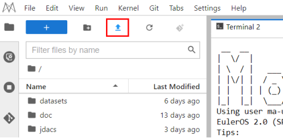

点击上传按钮来到下面这张上传页面，我们提供了4种上传文件的方式。如下图

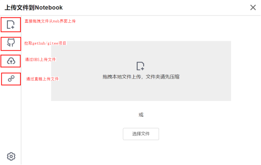

当然，你也可以直接在终端通过使用wget 直链的方式来上传文件。

直链demo：http://donggang.obs.cn-east-317.qdrgznjszx.com/Train_coco.zip

obs桶要设置为共享模式才可以生成直链

格式如下：donggang：桶名称|obs.cn-east-317.qdrgznjszx.com：桶所在的区域|Train_coco.zip：桶里面的文件

注意，上传文件后文件的保存位置要选在work目录下面，不然重启Notebook之后文件会被删除。

## 7 notebook文件回传

可以通过文件右键download键，将文件下载回本地。

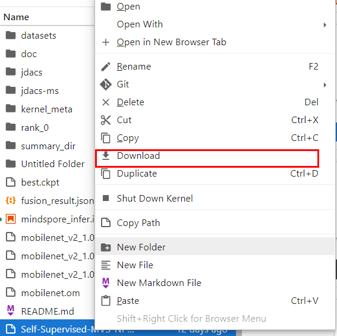

当训练后的模型过大，或者修改后的数据过大，没法使用页面上提供的download上传下载怎么办？
可以通过我们华为提供的moxing库来上传下载到obs。

MoXing是ModelArts自研的分布式训练加速框架，构建于开源的深度学习引擎TensorFlow、PyTorch等之上，使用MoXing API可让模型代码的编写更加简单、高效。

MoXing提供了一套文件对象API，可以用来读写OBS文件。

您可以通过MoXing API文档了解其与原生API对应关系，以及详细的接口调用示例，详细说明请参见
https://github.com/huaweicloud/ModelArts-Lab/blob/master/docs/moxing_api_doc/MoXing_API_File.md

示例代码：

```
import moxing as mox

#下载一个OBS文件夹sub_dir_0，从OBS下载至Notebook
mox.file.copy_parallel('obs://bucket_name/sub_dir_0', '/home/ma-user/work/sub_dir_0')
#下载一个OBS文件obs_file.txt，从OBS下载至Notebook
mox.file.copy('obs://bucket_name/obs_file.txt', '/home/ma-user/work/obs_file.txt')

#上传一个OBS文件夹sub_dir_0，从Notebook上传至OBS
mox.file.copy_parallel('/home/ma-user/work/sub_dir_0', 'obs://bucket_name/sub_dir_0')
#上传一个OBS文件obs_file.txt，从Notebook上传至OBS
mox.file.copy('/home/ma-user/work/obs_file.txt', 'obs://bucket_name/obs_file.txt')
```

## 8 裸金属服务器的obs使用

裸金属服务器的介绍详见 [裸金属服务器使用](7.裸金属服务器使用.md)

点击云资源 → ModelAtrs → 对象存储控制台

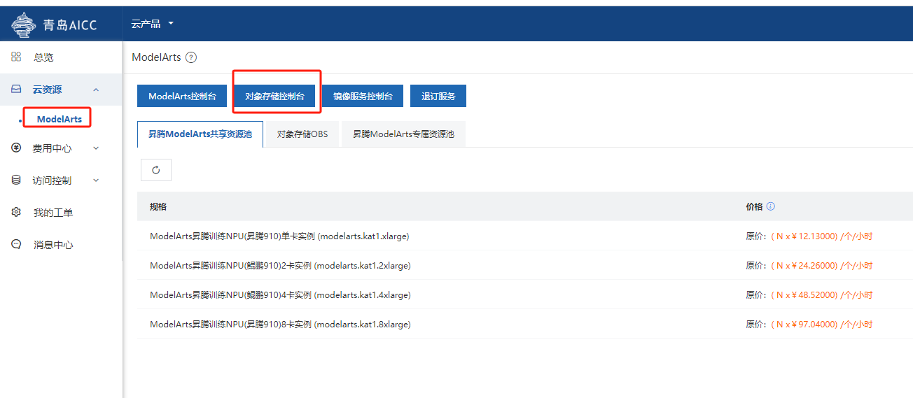

根据系统类型，下载对应的obs版本，青岛计算中心裸金属都为arm环境

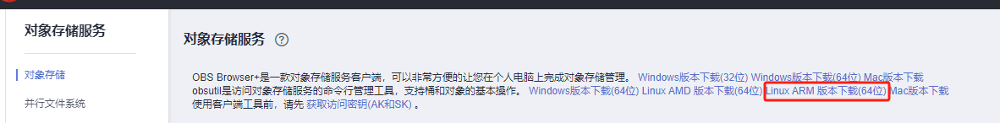

右键复制链接地址，加wget可直接在Linux环境下载。或单击下载后，传入裸金属服务器中。

直接下载指令：

wget https://obsbrowser.obs.qdrgznjszx.com/obsutil_hcso_linux_arm64_5.3.4.tar.gz

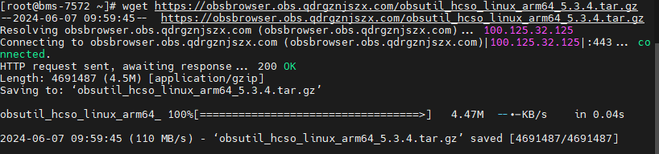

在软件包所在目录，执行以下解压命令

tar -xzvf obsutil_hcso_linux_arm64_5.3.4.tar.gz

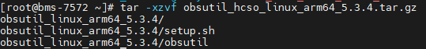

进入obsutil所在目录，执行以下命令，为obsutil增加可执行权限

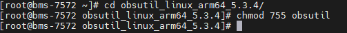

通过config命令对obsutil进行初始化配置

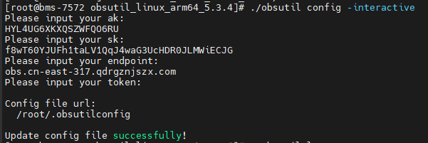

检查连通性

配置完成后，可以通过如下方式检查连通性，确认配置是否无误。

./obsutil ls -s

如果返回结果中包含“Bucket number is:”，表明配置正确。

如果返回结果中包含“Http status [403]”，表明访问密钥配置有误。

如果返回结果中包含“A connection attempt failed”，表明无法连接OBS服务，请检查网络环境是否正常。

obs新桶创建

./obsutil mb obs://桶名

以桶名bucket-test为例

./obsutil mb obs://bucket-test

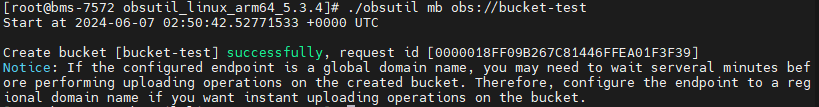

运行./obsutil cp /root/test.txt obs://bucket-test/test.txt命令，将本地test.txt文件上传至bucket-test桶中

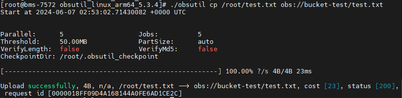

运行./obsutil cp obs://bucket-test/test.txt /root/test1.txt命令，将bucket-test桶中的test.txt对象下载至本地

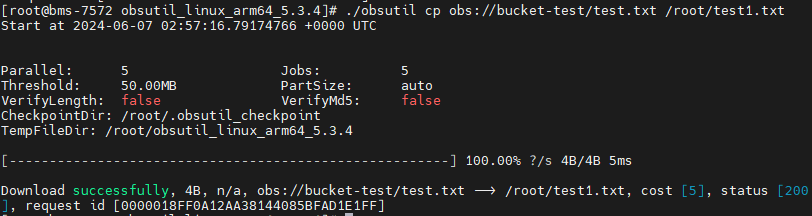

运行./obsutil rm obs://bucket-test/test.txt -f命令，在bucket-test桶中删除test.txt对象


运行./obsutil rm obs://bucket-test -f命令，删除bucket-test桶

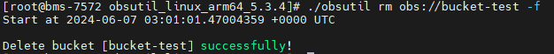

obs桶其余相关指令

https://docs.qdrgznjszx.com/zh-cn/utiltg/obs/obs_11_0007.html


## 9 异常处理

通过OBS下载文件到Notebook中时，提示Permission denied。请依次排查：

请确保读取的OBS桶和Notebook处于同一站点区域，不支持跨站点访问OBS桶。具体请参见查看OBS桶与ModelArts是否在同一个区域。
https://support.huaweicloud.com/trouble-modelarts/modelarts_13_0157.html#section2

请确认操作Notebook的账号有权限读取OBS桶中的数据。如没有权限，请参见在Notebook中，如何访问其他账号的OBS桶？。
https://support.huaweicloud.com/modelarts_faq/modelarts_05_0252.html
