# AI应用发布上线

AI应用发布上线需要先制作本地自启动镜像，使用该镜像创建AI应用，然后部署上线。

本教程以glm2-6b为例，演示应用发布上线操作。

## 1 镜像拉取

docker pull swr.cn-central-221.ovaijisuan.com/dxy/mindspore2_2_0:MindSpore2.2.0-cann7.0rc1_py_3.9-euler_2.8.3-32GB 

## 2 创建容器

使用脚本创建容器，需要开放8080端口

vim run.sh

```
#!/bin/bash

docker_images=swr.cn-central-221.ovaijisuan.com/dxy/mindspore2_2_0:MindSpore2.2.0-cann7.0rc1_py_3.9-euler_2.8.3-32GB 
docker run -it -p 8080:8080 -u root \
        --device=/dev/davinci0 \
        --device=/dev/davinci_manager \
        --device=/dev/devmm_svm \
        --device=/dev/hisi_hdc \
        -v ${model_dir}:${model_dir} \
        -v /etc/localtime:/etc/localtime \
        -v /usr/local/Ascend/driver/:/usr/local/Ascend/driver \
        -v /usr/local/Ascend/add-ons/:/usr/local/Ascend/add-ons \
        -v /var/log/npu/conf/slog/slog.conf:/var/log/npu/conf/slog/slog.conf \
        -v /var/log/npu/slog:/var/log/npu/slog \
        -v /var/log/npu/profiling:/var/log/npu/profiling \
        -v /usr/local/sbin:/usr/local/sbin \
        -v /var/log/npu/dump:/var/log/npu/dump \
        -v /var/log/npu:/usr/slog ${docker_images} \
        /bin/bash

```

运行脚本

bash run.sh

## 3 容器内安装

pip install flask

pip install mindformers==1.0.0

wget https://ascend-repo-modelzoo.obs.cn-east-2.myhuaweicloud.com/XFormer_for_mindspore/glm2/glm2_6b.ckpt

vim test_app.py

```
from flask import Flask, request
import json
app = Flask(__name__)
from mindformers import AutoConfig, AutoModel, AutoTokenizer
import mindspore as ms
ms.set_context(mode=ms.GRAPH_MODE, device_target="Ascend", device_id=0)
config = AutoConfig.from_pretrained("glm2_6b")
config.checkpoint_name_or_path = "/home/ma-user/glm2_6b.ckpt"
model = AutoModel.from_config(config)
tokenizer = AutoTokenizer.from_pretrained("glm2_6b")
#模型预热 AICC部署有请求时长限制，不预热的话会导致请求超时失败服务启动挂掉
print("模型开始预热")
inputs = tokenizer(tokenizer.build_prompt("hello"))["input_ids"]
outputs = model.generate(inputs, max_length=14096)
outputs_text = tokenizer.decode(outputs)
print(outputs_text)
print("模型预热完毕")
@app.route('/glm2_bot', methods=['POST'])
def say_hello_func():
 print("----------- in hello func ----------")
 data = json.loads(request.get_data(as_text=True))
 text = data['text']
 inputs = tokenizer(tokenizer.build_prompt(text))["input_ids"]
 print(tokenizer.decode(inputs))
 outputs = model.generate(inputs, max_length=14096)
 outputs_text = tokenizer.decode(outputs)
 return json.dumps({"response":outputs_text}, ensure_ascii=False,indent=4)
@app.route('/goodbye', methods=['GET'])
def say_goodbye_func():
 print("----------- in goodbye func ----------")
 return '\nGoodbye!\n'
@app.route('/', methods=['POST'])
def default_func():
 print("----------- in default func ----------")
 data = json.loads(request.get_data(as_text=True))
 return '\n called default func !\n {} \n'.format(str(data))
# host must be "0.0.0.0", port must be 8080
if __name__ == '__main__':
 app.run(host="0.0.0.0", port=8080)
```

运行检测程序是否正常

python test_app.py

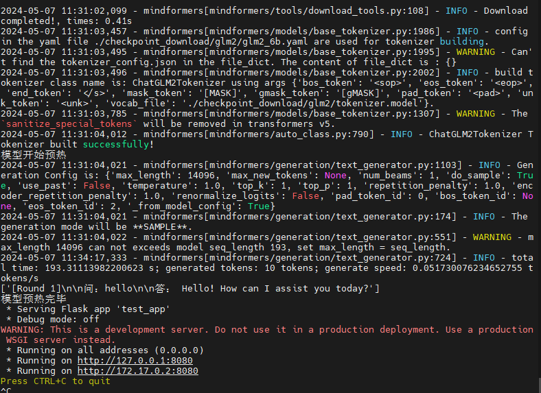

## 4 将当前容器保存为镜像

退出当前容器

exit

检查容器是否还在运行状态，如果未在运行，docker ps -a查看容器ID号。docker start 容器ID，运行容器

docker ps

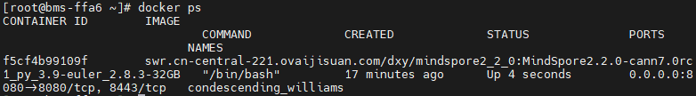

将当前容器保存为镜像glm_test:v2

docker commit 86be glm_test:v2

## 5 新建Dockerfile

使用Dockerfile制作自启动镜像

 vim Dockerfile

```
#/bin/bash
From  glm_test:v2
USER root
WORKDIR /home/ma-user

# 指定镜像的启动命令

ENTRYPOINT ["python", "/home/ma-user/test_app.py"]

```
在Dockerfile所在的路径下，执行指令制作镜像。为了后面能上传到AICC，镜像需要规范命名。示例中的组织名称为testorg，计算中心路径为swr.cn-east-317.qdrgznjszx.com

docker build -t swr.cn-east-317.qdrgznjszx.com/testorg/glm_test:v2 .

## 6 验证镜像

因为不能同时有两个容器使用8080端口，docker ps查看正在运行的容器，如果有容器在使用8080端口，Docker stop 容器ID ，停止这个容器。

vim run.sh

修改docker_images为新制作的镜像

docker_images=swr.cn-east-317.qdrgznjszx.com/testorg/glm_test:v2

bash run.sh

脚本执行后，无需进行额外操作，程序直接自启，自启镜像制作成功。

## 7 镜像上传

镜像服务控制台 → 我的镜像 → 客户端上传

获取临时登录指令

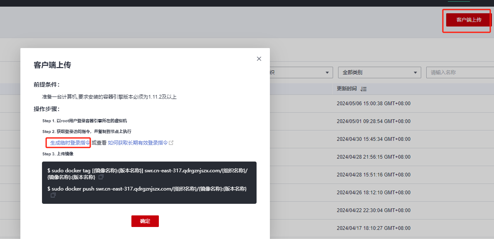

将临时登录指令粘到本地。

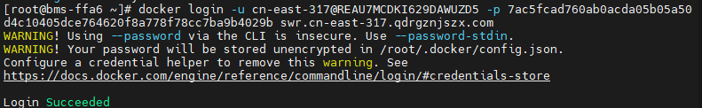

镜像上传

docker push swr.cn-east-317.qdrgznjszx.com/testorg/glm_test:v2

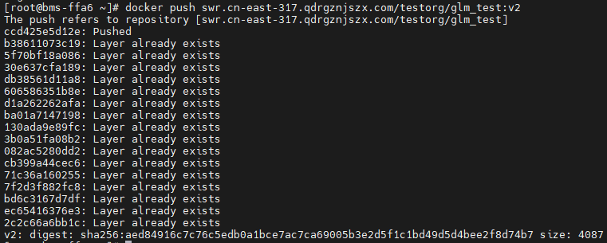

ModelArts → 镜像管理 → 注册镜像。在镜像源填入刚才上传的镜像

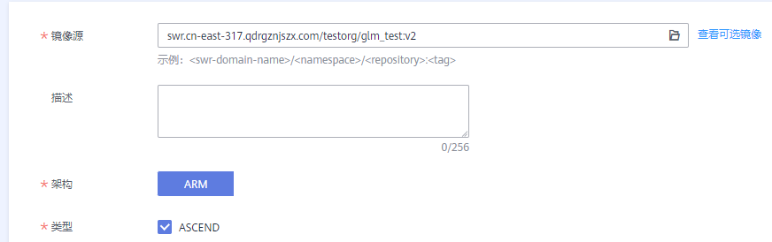

## 8 AI应用发布

ModelAtrs → AI应用管理 → AI应用 → 创建

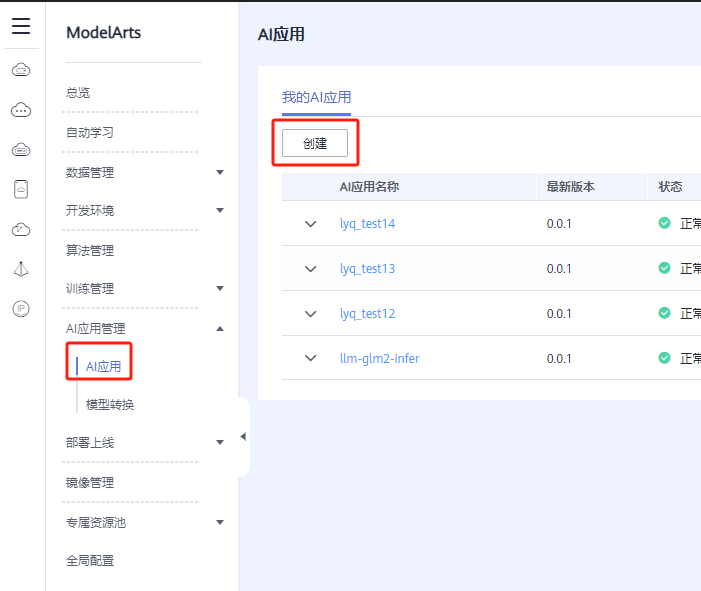

元模型来源，选择刚才上传的镜像

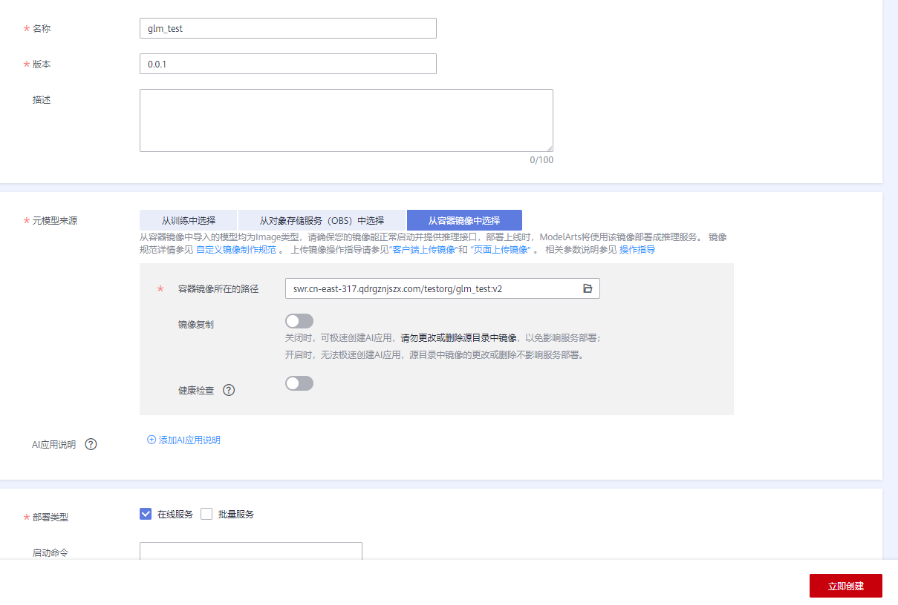

## 9 部署上线

ModelAtrs → 部署上线 → 在线服务 → 部署

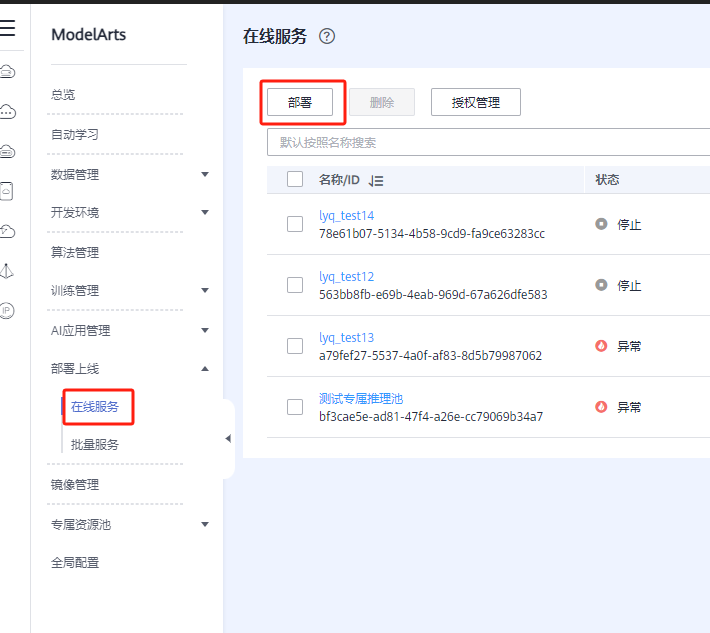

AI应用及版本选择刚才发布的AI应用

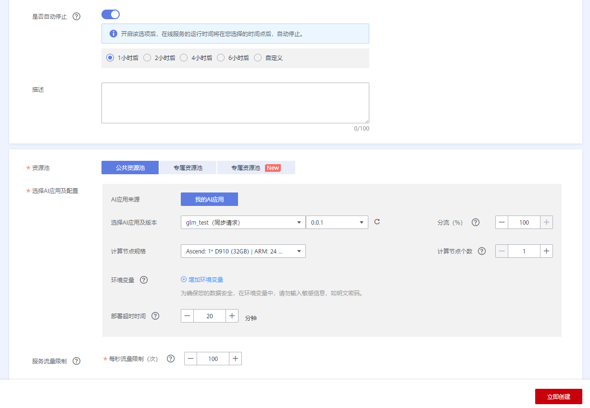

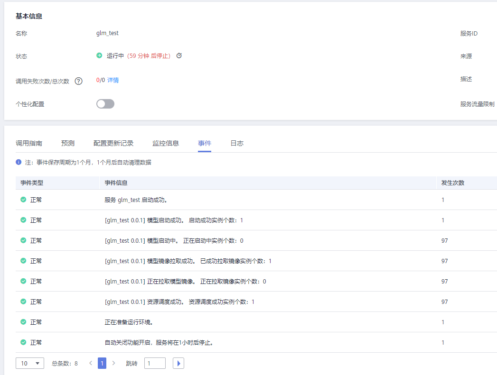

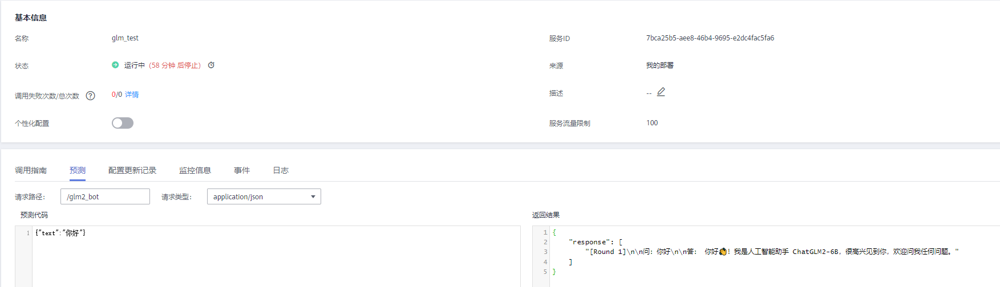
