# OBS云存储使用

## 1.OBS介绍

OBS Browser+是一款对象存储服务客户端，可以非常方便的让您在个人电脑上完成对象存储管理。
obsutil是访问对象存储服务的命令行管理工具，支持桶和对象的基本操作。
使用客户端工具前，请先获取访问密钥(AK和SK) 。

## 2.获取访问密钥

首先用主账号进入青岛AICC的服务控制台，选择云资源菜单下面的modelarts。


然后点击屏幕左上方访问密钥按钮。

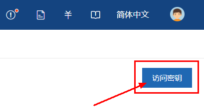

进行创建密钥，创建成功之后的界面如下图。

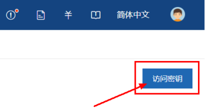

创建成功后密钥会自动下载并保存到本地，务必将密钥保存号，<font color=red>每个密钥只可以下载一次</font>

子账号的密钥与主账号共用，从主账号上获取

## 3.OBS创建桶

进入对象存储控制台，创建桶

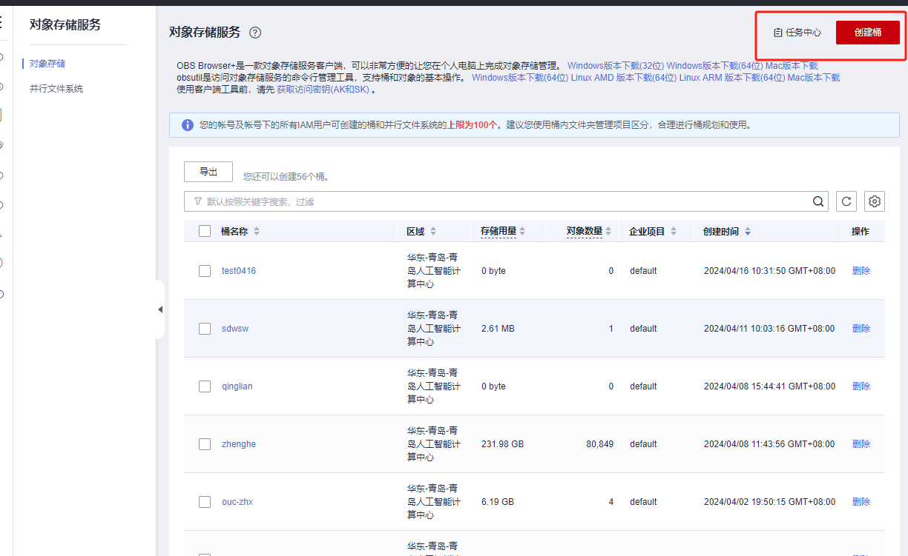

选择桶名称和权限

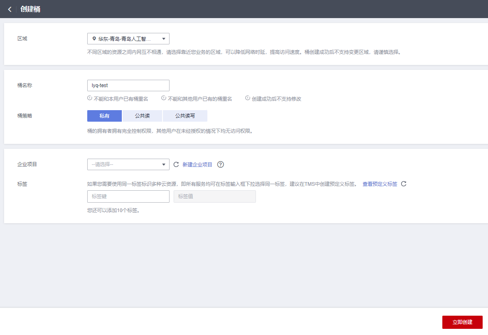

## 4.下载并登录OBS客户端

进入青岛AICC的服务控制台，选择云资源菜单下面的modelarts进入modelarts管理控制页面，选择对象存储控制台。


进入对象存储控制台后下载OBS Browers+对象存储的桌面客户端。

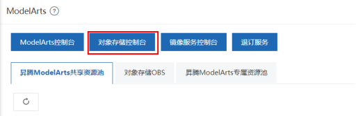

下载完成后打开客户端进行登录。


登录成功后会来到下面这个界面

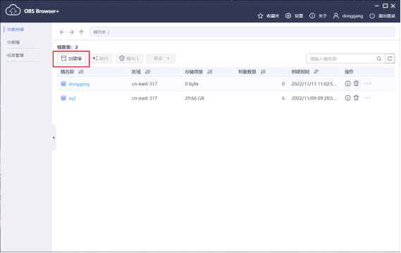

## 5.本地文件OBS上传下载

登录OBS客户端，选择已创建好的桶，上传文件

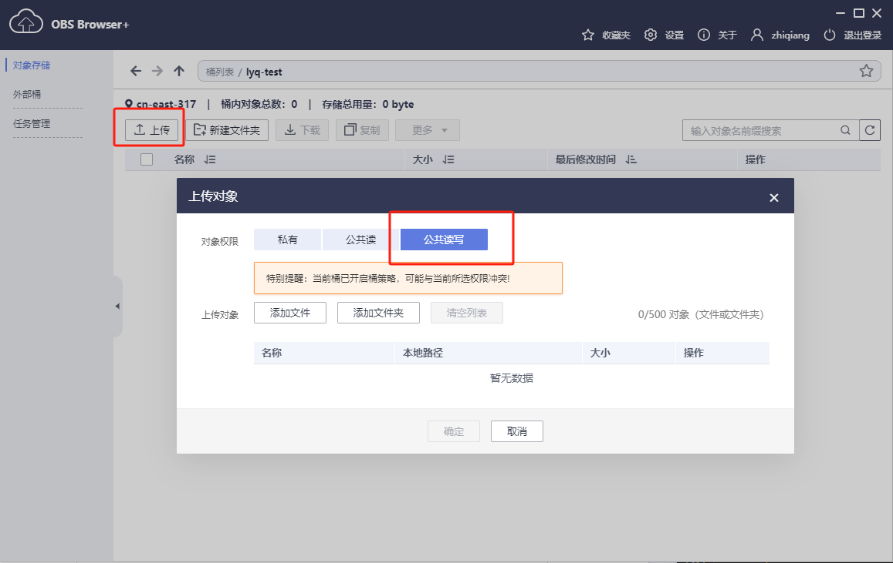

点击下载按钮可以直接下载文件

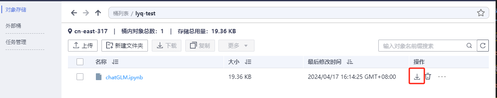

## 6.Notebook文件上传

如果使用网页端进行线上资源使用的话，拖拽上传文件的限制大小是<font color=red>100MB</font>，如果大于100MB就需要用OBS进行上传。

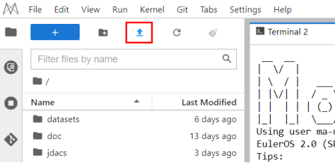

点击上传按钮来到下面这张上传页面，我们提供了4种上传文件的方式。如下图

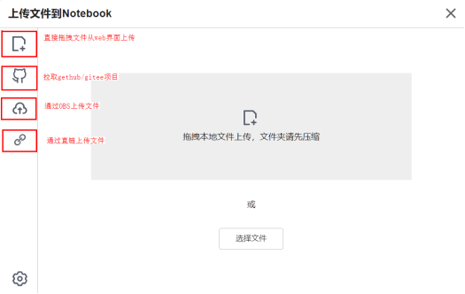

当然，你也可以直接在终端通过使用wget 直链的方式来上传文件。

直链demo：http://donggang.obs.cn-east-317.qdrgznjszx.com/Train_coco.zip

obs桶要设置为共享模式才可以生成直链

格式如下：donggang：桶名称|obs.cn-east-317.qdrgznjszx.com：桶所在的区域|Train_coco.zip：桶里面的文件

注意，上传文件后文件的保存位置要选在work目录下面，不然重启Notebook之后文件会被删除。

## 7.notebook文件回传

可以通过文件右键download键，将文件下载回本地。

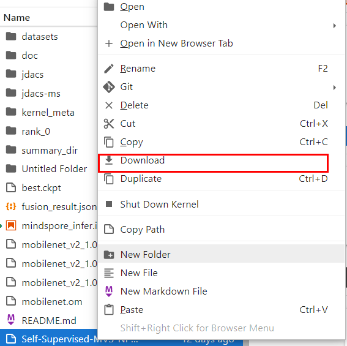

当训练后的模型过大，或者修改后的数据过大，没法使用页面上提供的download上传下载怎么办？
可以通过我们华为提供的moxing库来上传下载到obs。

MoXing是ModelArts自研的分布式训练加速框架，构建于开源的深度学习引擎TensorFlow、PyTorch等之上，使用MoXing API可让模型代码的编写更加简单、高效。

MoXing提供了一套文件对象API，可以用来读写OBS文件。

您可以通过MoXing API文档了解其与原生API对应关系，以及详细的接口调用示例，详细说明请参见
https://github.com/huaweicloud/ModelArts-Lab/blob/master/docs/moxing_api_doc/MoXing_API_File.md

示例代码：

```
import moxing as mox

#下载一个OBS文件夹sub_dir_0，从OBS下载至Notebook
mox.file.copy_parallel('obs://bucket_name/sub_dir_0', '/home/ma-user/work/sub_dir_0')
#下载一个OBS文件obs_file.txt，从OBS下载至Notebook
mox.file.copy('obs://bucket_name/obs_file.txt', '/home/ma-user/work/obs_file.txt')

#上传一个OBS文件夹sub_dir_0，从Notebook上传至OBS
mox.file.copy_parallel('/home/ma-user/work/sub_dir_0', 'obs://bucket_name/sub_dir_0')
#上传一个OBS文件obs_file.txt，从Notebook上传至OBS
mox.file.copy('/home/ma-user/work/obs_file.txt', 'obs://bucket_name/obs_file.txt')
```

## 8.异常处理

通过OBS下载文件到Notebook中时，提示Permission denied。请依次排查：

请确保读取的OBS桶和Notebook处于同一站点区域，不支持跨站点访问OBS桶。具体请参见查看OBS桶与ModelArts是否在同一个区域。
https://support.huaweicloud.com/trouble-modelarts/modelarts_13_0157.html#section2

请确认操作Notebook的账号有权限读取OBS桶中的数据。如没有权限，请参见在Notebook中，如何访问其他账号的OBS桶？。
https://support.huaweicloud.com/modelarts_faq/modelarts_05_0252.html