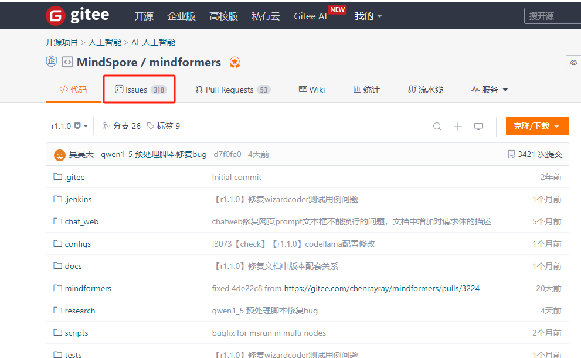
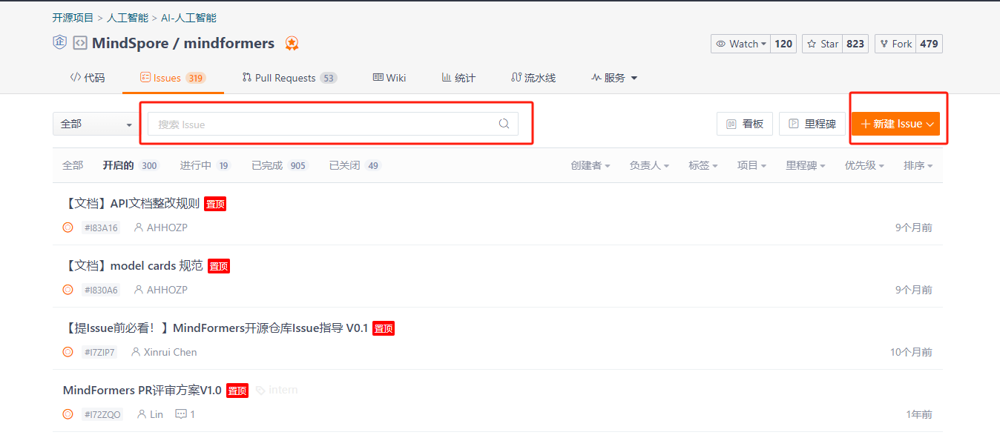
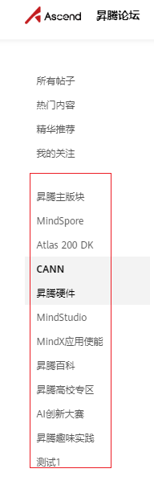
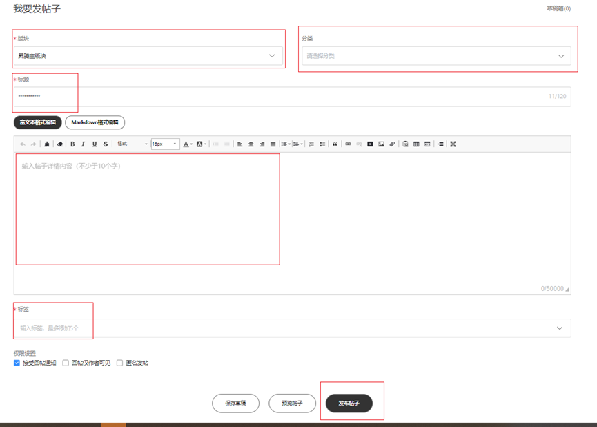
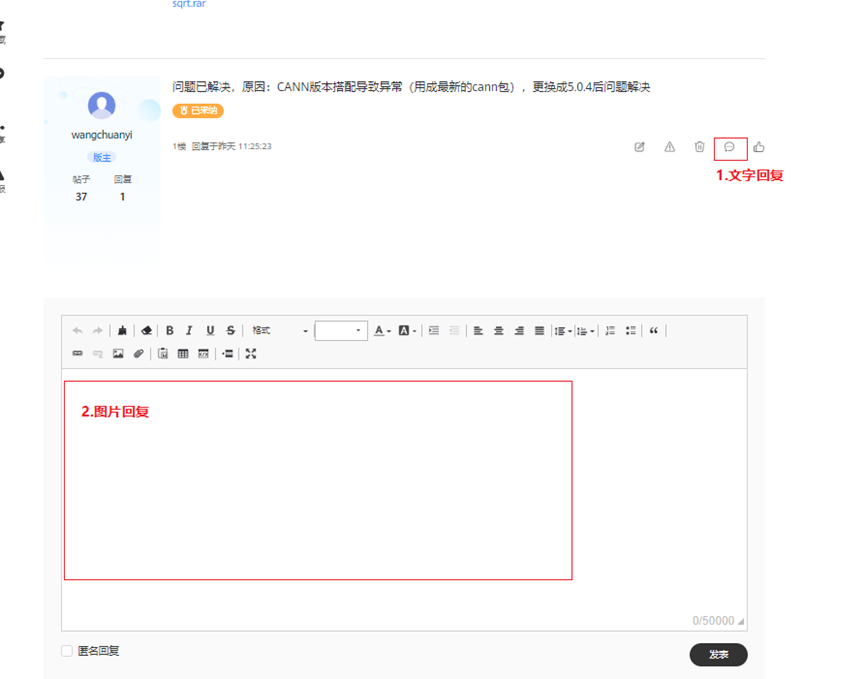

# 社区提问

在使用昇腾产品及相关套件工具时，难免会出现无法解决的问题，在对应的社区提issue，能和同样碰上问题的使用者交流信息，也会有专门的负责人答疑解惑。

## 通过gitee的issues提问

mindformers这类在gitee上发布的项目，可先找到对应的代码仓库，点击issues



### 提Issue之前，我需要准备什么？

请先前往对应Issue列表，搜索您想提的主题，看看是否已有同样主题的Issue存在或已解决。优先浏览这些内容以查看先前用户积累的经验，这或许可以使您较快地找到解决您需求的办法，而无需等待答复！



提Issue之时，首先判断Issue属于什么类型，之后根据相应的Issue规范填写。

### 如何判断我的Issue属于Question还是Bug-Report？

当你在使用套件时遇到预期外的情况，除非你非常、非常得有根据——一般情况下，除非你能够确切指出代码中不正确的地方、可以提供解决问题的源代码，或者提供回归测试来表明前一版本中的行为不正确，否则你都多半不够完全确信这是一个Bug（摘自《How To Ask Questions The Smart Way》）。无需担心，如果发现Question Issue中的问题确实由于Bug引起，仍会将按照Bug-fix流程来进行处理。

### 提Issue之后，我将何时收到回复？

Issue负责人每个工作日会关注所有进行中的Issue，通常负责团队会在注意到您的Issue时立即分配相关开发人员进行处理。请您关注Gitee通知以便及时收到负责人的回复。如果您在15天内没有回复负责人，可能会先行将您的Issue关闭，如果您还需要帮助，可以随时将Issue状态设为TODO以重新打开，负责团队会继续帮您解决问题。

### Issue规范
在MindFormers开源仓库提Issue时请尽量遵循此规范，这可以让相关负责人方便识别您的需求/问题并尽快让您得到回复！

#### 类型规范
MindFormers仓库目前接受的Issue类型为

Question：提出问题，如各种报错（启动失败、运行时错误）以及各种模型和特性的使用方法、条件等。

Bug-Report：错误报告，适用于使用中得到未达预期的结果，如果责任人识别后发现为非代码本身问题，将按照Question流程进行处理。

RFC：待确认的需求，适用于开发者和用户提出需求。

#### 标题规范
Issue标题必须清晰简明，下列给出一些标题的例子：

```
Question
【物理机】【MS1.10】【GLM2_6b】单机八卡微调报错：TypeError: Multiply values for specific argument: axis

【AICC】【Llama_65b】【权重上传】OBS进程数过多导致失败

Bug-Report
【物理机】【MS2.0】【GPT2】GPT2 tokenizer的pad token id不一致

RFC
【客户】【易用性】增加训练预估时间打印的功能

建议在标题前加上【项目】、【环境】、【模型】、【特性】等方便识别。
```

#### 内容规范

##### Question & Bug-Report

内容必须清晰描述问题细节，需要包含至少以下内容：

问题描述：简单描述问题的起因经过结果，展示错误截图，尽量在附件中上传完整日志

所用环境：包括硬件环境（使用的机器、芯片）、软件环境（MindSpore版本、MindFormers版本）

重现步骤：分步骤写明重现的步骤，便于开发者重现问题

预期结果：预期应当出现的结果

##### RFC

内容必须清晰描述需求细节，需要包含至少以下内容：

背景信息：简单描述需求的背景，包括当前存在的问题等

信息来源：阐述需求来源于何组织/部门，这将有助于我们指定需求优先级

价值/作用：解释完成这项需求能取得的关键价值

## 通过昇腾论坛提问

cann等没有直接代码项目的问题，可通过昇腾社区提问

https://www.hiascend.com/forum/all

### 发帖判别流程：

### 发帖到具体子板块判别流程：

#### 1.判别当前问题为：硬件问题、开发及运行环境部署问题、样例代码运行、模型算子开发问题、openlab实验室资源申请相关问题、工具等其他相关信息咨询类问题。

          硬件问题：

                   1. Atlas 200DK版块：客户使用Atlas200DK开发者套件遇到相关硬件异常可在此版块发帖，常见问题（a.制卡成功后，无法正常启动，指示灯异常b.摄像头连接相关问题c.判断为Atlas200DK硬件故障的问题）

                   2.昇腾硬件版块包括：Atlas200加速模块二次开发、atlas300加速卡、Atlas500边缘设备、Atlas800服务器遇到相关硬件异常可在此版块发帖，常见问题（1.相关设备信息无法识别2.设备启动、运行异常等）。

                   注意事项：1.用户一般所述的200，需明确是Atlas200加速模块二次开发的设备，还是Atlas200DK开发者套件，区别请查看：https://www.hiascend.com/forum/thread-0205101475840629001-1-1.html  2.对于Atlas800训练服务器、Atlas900Ai集群相关问题请沟通华为方技术支持接口人员协助。

         开发、运行环境部署问题：

                   说明：结合当前部署流程步骤具体配置产品名称，依次在对应标记版块发帖。

                   注意事项：1.相关mindstudio使用问题，在开发工具链版块发帖2.除运行环境配置固件驱动需在硬件版块发帖，其余配置问题结合当前配置环境名称在对应版块发帖。

         样例代码运行：

                   说明：Atlas200DK运行样例在200DK版块发帖，其余样例结合样例获取参考文档所属产品名称，在对应版块发帖。

                   注意事项：样例运行需严格按照配置要求确认环境版本匹配，环境变量配置无误。

         模型算子开发问题：

                   说明：除参考Mindspore相关文档获取的算子模型等问题在mindspore版块发帖，其他相关模型转换，模型开发，算子问题咨询，算子开发等在CANN版块发帖。

                   注意事项：发帖时需注意对应算子等信息参考文档来源所属版块。

         openlab实验室资源申请相关问题：

                   说明：在openlab昇腾实验室环境申请资源遇到问题皆可在此版块发帖

                   注意事项：1.部分客户使用ModelArts遇到相关问题会到此版块发帖，后续请移步ModelArts技术支撑版块发帖：https://bbs.huaweicloud.com/forum/forum-718-1.html

#### 2.华为云创建AI服务器资源使用遇到问题，请直接在华为云提工单请技术支持工程师协助处理：https://console.huaweicloud.com/ticket/?agencyId=09f3decec500f2e31f11c01992281f18&region=cn-south-1&locale=zh-cn#/ticketindex/createIndex

         其他昇腾产品相关信息咨询类问题：

                   说明：若以上各版块说明皆无法匹配发帖主题，则在昇腾论坛主版块发帖。

### 新手使用指引

        a.点击当前问题涉及的版块进入



         b.右上角点击我要发帖子选项


         c.填写对应分类、标题、主题内容、标签后点击：发布帖子（如果发布帖子按钮点击无反应，可能为内容有特殊命令或字符，需排除一下）



         d.发帖后关注版主回复，版主回复后请点击回复下面的消息按钮，这样版主才能收到新消息提醒，如果涉及图片可以在回复框内补充，若在2处发了图片，请在1处留个言提醒版主，对部分未及时回复的帖子请私信版主提醒。



发帖内容：

发贴时，请尽可能提供相关信息，以利尽快定位分析：1.参考配置文档链接2.具体异常现象及报错截图3.相关日志文件4.当前已做了哪些信息确认5.复现流程 6.提供相关工程模型文件