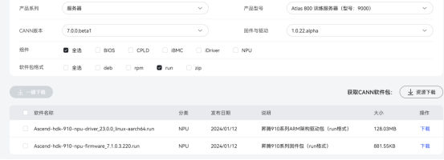
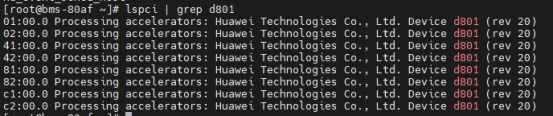
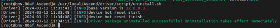
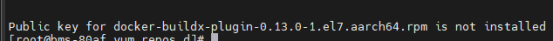

# 裸金属服务器使用

## 1.裸金属服务器介绍

裸金属服务器（Bare Metal Server，BMS）是一款兼具弹性云服务器和物理机性能的计算类服务，为您和您的企业提供专属的云上物理服务器，为核心数据库、关键应用系统、高性能计算、大数据等业务提供卓越的计算性能以及数据安全。租户可灵活申请，按需使用。

裸金属服务器的开通是自助完成的，您只需要指定具体的服务器类型、镜像、所需要的网络配置等，即可在30min内获得所需的裸金属服务器。

## 2.驱动固件安装

### 驱动固件下载

首次安装请按照“驱动->固件”的顺序；覆盖安装或升级请按照“固件->驱动”的顺序，分别安装软件包

软件包下载：

<https://www.hiascend.com/hardware/firmware-drivers/community?product=4&model=10&cann=7.0.0.beta1&driver=1.0.22.alpha>



### 确认操作系统

执行如下命令，查询服务器当前运行环境的操作系统架构及版本。
uname -m && cat /etc/*release

### 检查驱动

检查系统是否安装过软件包
执行lsmod|grep drv_pcie_host命令查询系统是否安装过软件包。

lsmod|grep drv_pcie_host

如无内容表示未安装过软件包。可以直接安装软件包。

如有内容，表示安装过软件包。需要先卸载驱动包后，再安装新版本软件包。

检测芯片是否正常在位

执行lspci | grep d801命令，如果服务器上有N（N＞0）张NPU芯片，回显中含“d801”字段的行数为N，则表示NPU芯片正常在位。

lspci | grep d801



### 卸载驱动

因为驱动和固件版本需一致，刚申请使用的裸金属服务器只有驱动，没有固件，所以需要先卸载，再安装和固件一致版本的驱动

确认卸载方式

dpkg -l | grep Ascend

或apt list ascend910*

若可以查询到驱动或固件，则说明使用deb包安装。

rpm -qa | grep Ascend

若可以查询到驱动或固件，则说明使用rpm包安装。


若使用这几种命令都查询不到驱动或固件，则说明使用run包安装。

本环境中使用run包安装

在任意路径执行如下命令卸载软件包：

<install-path>/driver/script/uninstall.sh

<install-path>表示软件包安装路径，可以执行cat /etc/ascend_install.info命令查询安装路径；请根据实际情况替换。

本环境中该路径为：

/usr/local/Ascend

/usr/local/Ascend/driver/script/uninstall.sh

若出现如下关键回显信息，则表示驱动卸载成功。



根据系统提示信息决定是否重启服务器，若需要重启系统，请执行以下命令；否则，请跳过此步骤。

reboot

*驱动卸载后，npu-smi工具不可用。

### 安装驱动

适用于.run格式

下载Ascend-hdk-910-npu-driver_23.0.0_linux-aarch64.run

.run文件驱动安装

将文件Ascend-hdk-910-npu-driver_23.0.0_linux-aarch64.run放入/opt路径下（路径可更改）

执行如下命令，增加软件包的可执行权限

chmod +x Ascend-hdk-910-npu-driver_23.0.0_linux-aarch64.run

执行如下命令，校验run安装包的一致性和完整性。

./Ascend-hdk-910-npu-driver_23.0.0_linux-aarch64.run --check

执行如下命令，完成驱动安装，软件包默认安装路径为“/usr/local/Ascend

./Ascend-hdk-910-npu-driver_23.0.0_linux-aarch64.run --full

根据提示选择是否重启

reboot

驱动安装成功，可使用指令

npu-smi info

### 安装固件

将Ascend-hdk-910-npu-firmware_7.1.0.3.220.run放入/opt路径下（路径可更改）

执行如下命令，增加软件包的可执行权限。

chmod +x Ascend-hdk-910-npu-firmware_7.1.0.3.220.run

执行如下命令，校验run安装包的一致性和完整性

./Ascend-hdk-910-npu-firmware_7.1.0.3.220.run --check

执行如下安装命令完成安装。

./Ascend-hdk-910-npu-firmware_7.1.0.3.220.run --full
根据提示选择是否重启

reboot
#执行如下命令查看芯片固件版本号。若与目标版本一致，则说明安装成功。

/usr/local/Ascend/driver/tools/upgrade-tool --device_index -1 --component -1 --version

固件安装成功

## 3.docker安装

请检查“/etc/yum.repos.d”中是否存在“docker-ce.repo”源文件，如果存在，则检查源是否正确，如果没有源文件或配置源，请配置可用的源。

以centOS7.6系统为例。

登录源链接，根据现场操作系统架构和版本，进入对应操作系统目录，单击打开“source.repo”文件，将文件内源链接添加到服务器“/etc/yum.repos.d/CentOS-Base.repo”文件后面，要包含Docker-ce相关的源。

下载关于docker的相关依赖环境

https://gitee.com/ascend/ascend-deployer/tree/master/downloader/config

yum -y install yum-utils device-mapper-persistent-data lvm2

执行以下命令，更新源并安装Docker。

yum makecache fast

yum install docker-ce

如果出现错误：



可执行yum --nogpgcheck install docker-ce命令安装Docker。

执行docker version命令查看Docker是否已启动

如果显示类似以下问题，则表示Docker已安装未启动，可执行service docker start命令启动Docker。

Cannot connect to the Docker daemon at unix:///var/run/docker.sock. Is the docker daemon running?

## 4.mindformers镜像安装

镜像源列表

http://mirrors.cn-central-221.ovaijisuan.com/mirrors.html

docker单独下载命令

docker pull [OPTIONS] NAME[:TAG|@DIGEST]


docker启动脚本

新建一个.sh格式脚本

vim run.sh

```
#!/bin/bash

docker_images=swr.cn-central-221.ovaijisuan.com/mindformers/mindformers0.8.0_mindspore2.2.0:aicc_20231025
docker run -it -u root --ipc=host --net=host \
        --device=/dev/davinci0 \
        --device=/dev/davinci1 \
        --device=/dev/davinci2 \
        --device=/dev/davinci3 \
        --device=/dev/davinci4 \
        --device=/dev/davinci5 \
        --device=/dev/davinci6 \
        --device=/dev/davinci7 \
        --device=/dev/davinci_manager \
        --device=/dev/devmm_svm \
        --device=/dev/hisi_hdc \
        -v ${model_dir}:${model_dir} \
        -v /usr/local/Ascend/driver/:/usr/local/Ascend/driver \
        -v /usr/local/Ascend/add-ons/:/usr/local/Ascend/add-ons \
        -v /var/log/npu/conf/slog/slog.conf:/var/log/npu/conf/slog/slog.conf \
        -v /var/log/npu/slog:/var/log/npu/slog \
        -v /var/log/npu/profiling:/var/log/npu/profiling \
        -v /usr/local/sbin:/usr/local/sbin \
        -v /var/log/npu/dump:/var/log/npu/dump \
        -v /var/log/npu:/usr/slog ${docker_images} \
        /bin/bash
```

执行脚本

bash run.sh

如果没有预先pull镜像，直接启动脚本也能下拉镜像

执行脚本后进入容器环境，但该脚本是容器创建指令，不是进入容器指令，每次执行该脚本都会进入一个新的容器。

## 5.Docker常见指令

查询所有镜像

docker images

查看运行的容器

docker ps

查询所有容器实例

docker ps -a

拉起一个容器实例

docker run -it{IMAGE ID}

启动一个容器实例

docker start{CONTAINER ID}

以root用户进入某个容器

docker exec -it-u root {CONTAINER ID} /bin/bash

使用docker ps查看容器，获得容器的CONTAINER ID，该ID在本地是唯一ID，从容器创建到删除一直保持一致，使用同一个镜像源启动容器，ID也不会相同

如果查看不到要使用的容器，说明该容器以停止运行，无法进入停止运行的容器，需要先启动再进入。

使用docker ps -a查看所有容器ID，使用docker start{CONTAINER ID}启动这个容器。

以root用户进容器docker exec -it-u root {CONTAINER ID} /bin/bash

