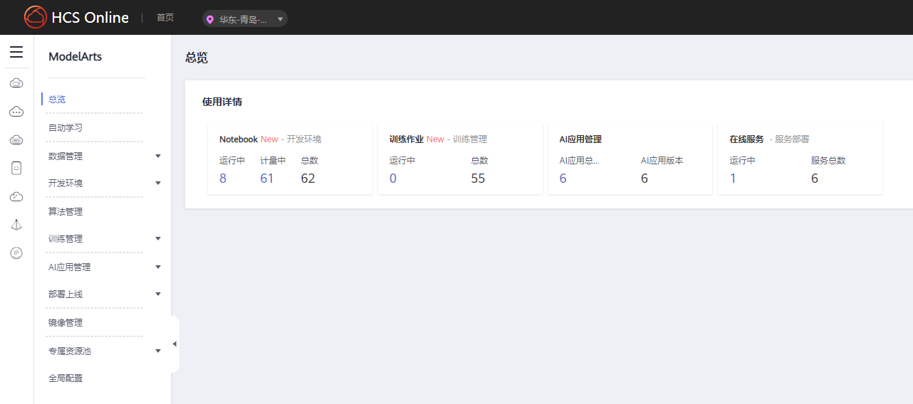

# AICC介绍使用文档

## 1 青岛人工智能技术中心介绍

青岛人工智能计算中心（Qingdao Artificial Intelligence Computing Center）是山东省内首个人工智能计算中心，首期建设100P算力，是基于自主创新的昇腾人工智能芯片构建的计算机集群，也是一体化、集约化、节能降耗的城市公共算力基础设施；面向社会提供普惠公共算力和人工智能应用创新等服务，解决人工智能企业的算力昂贵转型难题，推动人工智能技术与青岛重点行业应用深度结合，为青岛数字经济的蓬勃发展注入强劲动能。

解决人工智能领域算力“用不起”、“用不上”、“用不好”三大挑战。

用得起：政府统建，远低于市场的算力价格，提供算力租用服务。

用得上：国产化算力平台，全栈自主可控的人工智能计算中心；提供业界领先的模型训练极致性能，随取随用；各种开发套件，降低开发难度，调用华为全栈知识。

用得好：免费、易获取的适配资源；当地运营团队，遇到问题随时解决；专家贴身服务，提供算法调优服务

青岛人工智能计算中心搭载ModelAtr面向AI开发者的平台工具。

## 2 青岛人工智能计算中心底层硬件设备

Altas900 PoD （一个机柜，8台类800-9000训练服务器）

硬件设备参数：

CPU：32* 鲲鹏920CPU

NPU：64* 昇腾910NPU 单台服务器1.76P

显存：32G

内存：256* 32GB DDR4 RAM，最高3200 MT/s

存储：80* 1.5T，2.5英寸硬盘

公共存储：4022TB SATA HDD

出口带宽：500Mbit/s

内网带宽：25GE

## 3 ModelAtrs平台介绍

ModelAtrs是面向开发者的一站式AI开发平台，可快速创建和部署模型，管理全周期AI工作流，助力千行百业智能升级。

稳定安全的算力底座，极快至简的模型训练：支持万节点计算集群管理；大规模分布式训练能力，加速大模型研发。

零代码自动学习，AI应用高灵活、低门槛：可根据标注数据自动设计模型、自动调参、自动训练、自动压缩和部署模型；支持图像分类、物体检测、声音分类等模型的定制化开发，满足不同领域需求。

云上 Notebook 服务，案例内容秒级接入：在 ModelArts Studio 中统一管理 AI 开发全流程，提升开发效率，记录模型构建实验全流程；本地 IDE+ModelArts 插件远程开发能力，运行环境自定义，云上云下，无缝协同。

多场景部署，灵活满足业务需求：支持云端/边端部署等多种生产环境；支持在线推理、批量推理、边缘推理多形态部署。

## 4 资源租用计费方式

共享资源：共享资源租用方式需每次启动环境时，需从共享资源池申请ascend计算资源，并按照使用需求设置运行停止时间，到达停止时间环境自动停止，或手动停止环境后，计算资源自动释放。单个环境可申请1卡、2卡、4卡、8卡多种规格计算资源。

共享资源按使用卡时计费，先付费后使用，环境启动时开始计费，环境关闭时停止计费，多环境多卡按照卡时累加计费。

专有资源：专属资源租用方式独占计算资源，创建环境时不需要排队申请。

专属资源按照资源占用卡数和时长计费，使用时长以月尾单位，先付费后使用。无论卡是否在使用，只要开始计费，资源被划为独占模式，就会累计使用时长。

## 5 算力购买方式

由于算力购买需要签署合同，有购买需求请联系生态经理，生态经理会根据算力购买量具体报价

[账号申请](2.账号申请.md)

[资源申请](3.资源申请.md)

[Notebook训练环境使用](4.Notebook训练环境使用.md)

[Notebook镜像上传下载](5.Notebook镜像上传下载.md)

[OBS云存储使用](6.OBS云存储使用.md)

[AI应用发布上线](7.AI应用发布上线.md)

[裸金属服务器使用](8.裸金属服务器使用.md)
